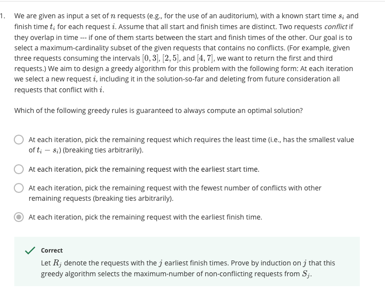
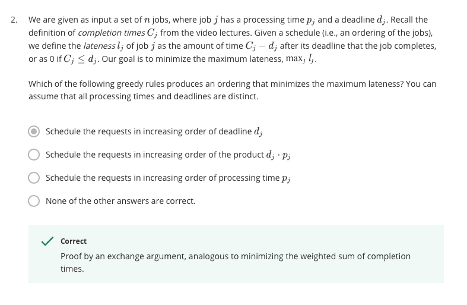

cardinality: the number of members in a set
**Proof**: Suppose the request with the earliest finish time is *a* . Let *b* denote any other request conflicting with *a* (so either *a* or *b* ) and *a*'s finish time is earlier than *b* ' s finish time. To contracdict, pick *b* first will produce the optimal solution. If we exchange *b* with *a* , the number of non-conflicting members will be non- change or decreased. Because requests conflicting with *a* (its finish time is later than *a* 's finish time) also conflict with *b* as *b* 's finish time. So to pick the remaining request with the earliest finish time at least as good as the other selection.

**Proof**: Suppose we rename the jobs by the increasing order of deadline *dj* .  If we exchange any consecutive pair's order( *di* < *dj* ). Others' penalitied don't change. However, before is max( *pi* - *di* , *pi* + *pj* - *dj* ), while after is max( *pj* - *dj* , *pi* + *pj* - *di* ) . So after is larger as $pi+pj-di>pi-di$ and $pi+pj-di>pi+pj-dj$